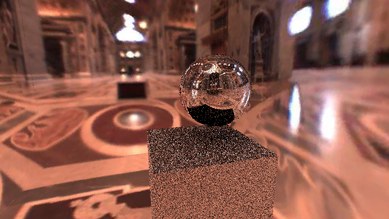

# MISRayTracingInUnity
 * Implement custom scriptable render pipeline for ray trace.
 * Include the material with closest hit shader that is same as Peter Shirley's Ray Tracing series.
 * Apply MIS with specular and diffuse pdf.
 * Introduced HDR enviornment map from cube map
 * Support AI denoising, including Intel Open Image Denoise and Nvidia Optix Denoiser

### Work Framework Description
 * `Assets/RT Render Pipeline/Runtime/`includes core srp script `Ray Tracing Render Pipeline` and basic parent class `Ray Tracing Manager`.  Besides, two asset files are used to provide SO interface to manage properties in inspector. 
 * The mesh that needs to be drawn needs to be manually added to the list of SceneManager in the inspector, so that the acceleration structure are able to be built, where `Assets/RT Render Pipeline/Runtime/SceneManager` takes charge of these thing.
 * Inherit and extend the parent class `Ray Tracing Manager` to implement a separate raytrace, including control of memory allocation, communication with shader, etc.

### Workflow 
Sort by time (newest to oldest)
Expand for images.

AI denoising, using Nvidia Optix Denoiser, sample with one ray per pixel

// 

HDR Environment map is included (Image-based multiple light source)

// 

AI denoising, using Nvidia Optix Denoiser, sample with one ray per pixel

MIS, One bounce reflection without denoiser

HDR Tone mapping

Implement the cornell box using mixture pdf between based-on-light and based-on-random-normal-on-sphere

Implement the ray trace among the three material of Diffuse, Dielectrics and Metal

